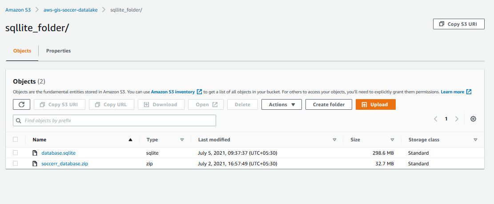
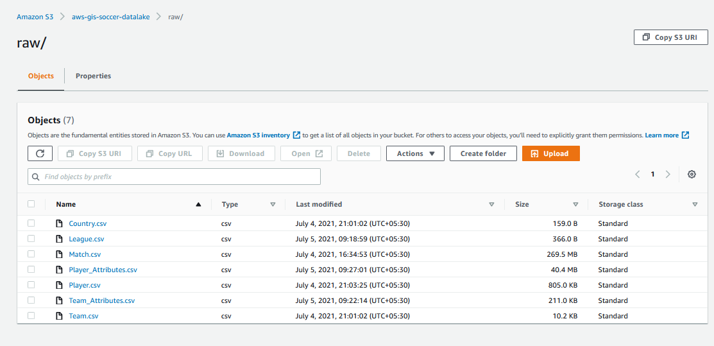
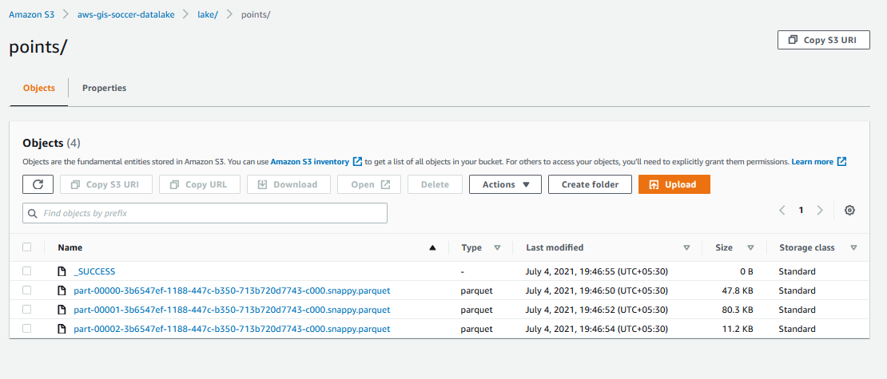
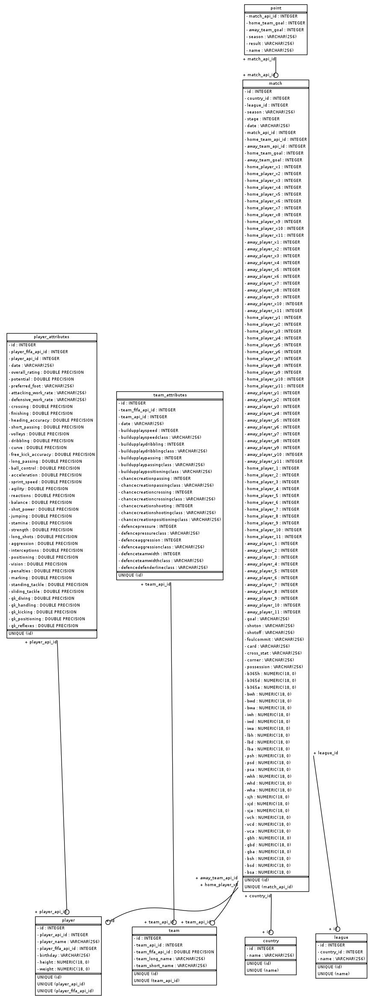
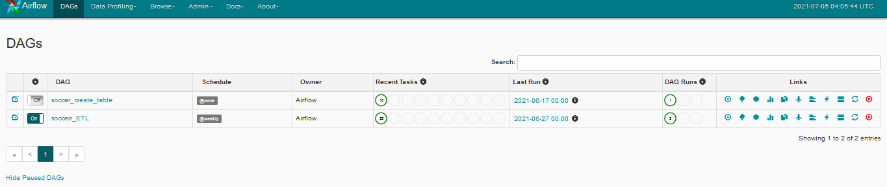
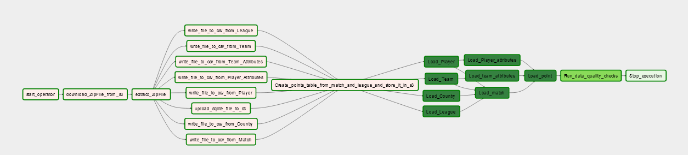

# Soccer Leagues Points 
### Data Engineering Capstone Project

#### Project Summary
European Soccer Database consist of all the matches players from Season 2008 to 2016. Dataset has many different tables we will have to understand and gather meaningful insights and transform the data to fetch the league points table at every stage of the respective season for the leagues.

The project follows the follow steps:
* Step 1: Scope the Project and Gather Data
* Step 2: Explore and Assess the Data
* Step 3: Define the Data Model
* Step 4: Run ETL to Model the Data
* Step 5: Complete Project Write Up


```python
# Do all imports and installs here
import pandas as pd
from sqlalchemy import create_engine
import boto3
```

### Step 1: Scope the Project and Gather Data

#### Scope 
The scope of the Project is to build a Data Pipeline using Apache Airflow to build pipeline of tasks which include create tables, load the staging tables to Amazon Redshift, transfrom the staging tables using Pandas and load the transformed data back to Amazon Redshift.
Raw match data consist of all the +25000 matches played from the season 2008 to 2016 in all the 11 European Countries, we need to calculate the points earned by teams in a single match for each stage. 
For each match played, a team with the more no of goals than the other will earn 3 points, if it is a draw then it will 1 point else if team losses then it 0 point.
A stage represents matches played in a single week of season by all the teams in a single league. So will try to transform data so that we can check at which week(stage) of the season how much points were earned by the team. This data will then be used to analyse the performance of the team.


#### Describe and Gather Data 
The dataset used in this project comes from the Kaggle's European Soccer Database as you can see below image which lists all the tables. i Doownlaoded zip file and uploaded the file to S3 for convenience.


After preprocessing of data, csv and paraquet files will be created as below and finally we will store it in redshift cluster.






This dataset includes the following:
1. +25,000 matches
2. +10,000 players
3. 11 European Countries with their lead championship
4. Seasons 2008 to 2016
5. Players and Teams' attributes* sourced from EA Sports' FIFA video game series, including the weekly updates
6. Team line up with squad formation (X, Y coordinates)
7. Betting odds from up to 10 providers
8. Detailed match events (goal types, possession, corner, cross, fouls, cards etc…) for +10,000 matches

The different tables and their schema is given below


```python
# Please note in the Airflow datapipeline I have created a StageToRedshiftOperator to load all the csv from S3 to redshift. I am loading the tables from redshift using pandas
df_country = pd.read_csv('soccer_dataset/Country.csv')
df_country.head()

```


<div>
<style scoped>
    .dataframe tbody tr th:only-of-type {
        vertical-align: middle;
    }

    .dataframe tbody tr th {
        vertical-align: top;
    }

    .dataframe thead th {
        text-align: right;
    }
</style>
<table border="1" class="dataframe">
  <thead>
    <tr style="text-align: right;">
      <th></th>
      <th>Unnamed: 0</th>
      <th>countryid</th>
      <th>country</th>
    </tr>
  </thead>
  <tbody>
    <tr>
      <th>0</th>
      <td>0</td>
      <td>1</td>
      <td>Belgium</td>
    </tr>
    <tr>
      <th>1</th>
      <td>1</td>
      <td>1729</td>
      <td>England</td>
    </tr>
    <tr>
      <th>2</th>
      <td>2</td>
      <td>4769</td>
      <td>France</td>
    </tr>
    <tr>
      <th>3</th>
      <td>3</td>
      <td>7809</td>
      <td>Germany</td>
    </tr>
    <tr>
      <th>4</th>
      <td>4</td>
      <td>10257</td>
      <td>Italy</td>
    </tr>
  </tbody>
</table>
</div>


```python
# Data and Schema For Team Tables
df_league = pd.read_csv('soccer_dataset/League.csv')
df_league.head()

```


<div>
<style scoped>
    .dataframe tbody tr th:only-of-type {
        vertical-align: middle;
    }

    .dataframe tbody tr th {
        vertical-align: top;
    }

    .dataframe thead th {
        text-align: right;
    }
</style>
<table border="1" class="dataframe">
  <thead>
    <tr style="text-align: right;">
      <th></th>
      <th>Unnamed: 0</th>
      <th>id</th>
      <th>country_id</th>
      <th>name</th>
    </tr>
  </thead>
  <tbody>
    <tr>
      <th>0</th>
      <td>0</td>
      <td>1</td>
      <td>1</td>
      <td>Belgium Jupiler League</td>
    </tr>
    <tr>
      <th>1</th>
      <td>1</td>
      <td>1729</td>
      <td>1729</td>
      <td>England Premier League</td>
    </tr>
    <tr>
      <th>2</th>
      <td>2</td>
      <td>4769</td>
      <td>4769</td>
      <td>France Ligue 1</td>
    </tr>
    <tr>
      <th>3</th>
      <td>3</td>
      <td>7809</td>
      <td>7809</td>
      <td>Germany 1. Bundesliga</td>
    </tr>
    <tr>
      <th>4</th>
      <td>4</td>
      <td>10257</td>
      <td>10257</td>
      <td>Italy Serie A</td>
    </tr>
  </tbody>
</table>
</div>


```python
# Data and Schema For Team Tables
df_team = pd.read_csv('soccer_dataset/Team.csv')
df_team.head()
```


<div>
<style scoped>
    .dataframe tbody tr th:only-of-type {
        vertical-align: middle;
    }

    .dataframe tbody tr th {
        vertical-align: top;
    }

    .dataframe thead th {
        text-align: right;
    }
</style>
<table border="1" class="dataframe">
  <thead>
    <tr style="text-align: right;">
      <th></th>
      <th>Unnamed: 0</th>
      <th>id</th>
      <th>team_api_id</th>
      <th>team_fifa_api_id</th>
      <th>team_long_name</th>
      <th>team_short_name</th>
    </tr>
  </thead>
  <tbody>
    <tr>
      <th>0</th>
      <td>0</td>
      <td>1</td>
      <td>9987</td>
      <td>673.0</td>
      <td>KRC Genk</td>
      <td>GEN</td>
    </tr>
    <tr>
      <th>1</th>
      <td>1</td>
      <td>2</td>
      <td>9993</td>
      <td>675.0</td>
      <td>Beerschot AC</td>
      <td>BAC</td>
    </tr>
    <tr>
      <th>2</th>
      <td>2</td>
      <td>3</td>
      <td>10000</td>
      <td>15005.0</td>
      <td>SV Zulte-Waregem</td>
      <td>ZUL</td>
    </tr>
    <tr>
      <th>3</th>
      <td>3</td>
      <td>4</td>
      <td>9994</td>
      <td>2007.0</td>
      <td>Sporting Lokeren</td>
      <td>LOK</td>
    </tr>
    <tr>
      <th>4</th>
      <td>4</td>
      <td>5</td>
      <td>9984</td>
      <td>1750.0</td>
      <td>KSV Cercle Brugge</td>
      <td>CEB</td>
    </tr>
  </tbody>
</table>
</div>


```python
# Data and Schema For Team Attribues Tables
df_team_attributes = pd.read_csv('soccer_dataset/TeamAttributes.csv')
df_team_attributes.head()
```


<div>
<style scoped>
    .dataframe tbody tr th:only-of-type {
        vertical-align: middle;
    }

    .dataframe tbody tr th {
        vertical-align: top;
    }

    .dataframe thead th {
        text-align: right;
    }
</style>
<table border="1" class="dataframe">
  <thead>
    <tr style="text-align: right;">
      <th></th>
      <th>Unnamed: 0</th>
      <th>id</th>
      <th>team_fifa_api_id</th>
      <th>team_api_id</th>
      <th>date</th>
      <th>buildUpPlaySpeed</th>
      <th>buildUpPlaySpeedClass</th>
      <th>buildUpPlayDribbling</th>
      <th>buildUpPlayDribblingClass</th>
      <th>buildUpPlayPassing</th>
      <th>...</th>
      <th>chanceCreationShooting</th>
      <th>chanceCreationShootingClass</th>
      <th>chanceCreationPositioningClass</th>
      <th>defencePressure</th>
      <th>defencePressureClass</th>
      <th>defenceAggression</th>
      <th>defenceAggressionClass</th>
      <th>defenceTeamWidth</th>
      <th>defenceTeamWidthClass</th>
      <th>defenceDefenderLineClass</th>
    </tr>
  </thead>
  <tbody>
    <tr>
      <th>0</th>
      <td>0</td>
      <td>1</td>
      <td>434</td>
      <td>9930</td>
      <td>2010-02-22 00:00:00</td>
      <td>60</td>
      <td>Balanced</td>
      <td>NaN</td>
      <td>Little</td>
      <td>50</td>
      <td>...</td>
      <td>55</td>
      <td>Normal</td>
      <td>Organised</td>
      <td>50</td>
      <td>Medium</td>
      <td>55</td>
      <td>Press</td>
      <td>45</td>
      <td>Normal</td>
      <td>Cover</td>
    </tr>
    <tr>
      <th>1</th>
      <td>1</td>
      <td>2</td>
      <td>434</td>
      <td>9930</td>
      <td>2014-09-19 00:00:00</td>
      <td>52</td>
      <td>Balanced</td>
      <td>48.0</td>
      <td>Normal</td>
      <td>56</td>
      <td>...</td>
      <td>64</td>
      <td>Normal</td>
      <td>Organised</td>
      <td>47</td>
      <td>Medium</td>
      <td>44</td>
      <td>Press</td>
      <td>54</td>
      <td>Normal</td>
      <td>Cover</td>
    </tr>
    <tr>
      <th>2</th>
      <td>2</td>
      <td>3</td>
      <td>434</td>
      <td>9930</td>
      <td>2015-09-10 00:00:00</td>
      <td>47</td>
      <td>Balanced</td>
      <td>41.0</td>
      <td>Normal</td>
      <td>54</td>
      <td>...</td>
      <td>64</td>
      <td>Normal</td>
      <td>Organised</td>
      <td>47</td>
      <td>Medium</td>
      <td>44</td>
      <td>Press</td>
      <td>54</td>
      <td>Normal</td>
      <td>Cover</td>
    </tr>
    <tr>
      <th>3</th>
      <td>3</td>
      <td>4</td>
      <td>77</td>
      <td>8485</td>
      <td>2010-02-22 00:00:00</td>
      <td>70</td>
      <td>Fast</td>
      <td>NaN</td>
      <td>Little</td>
      <td>70</td>
      <td>...</td>
      <td>70</td>
      <td>Lots</td>
      <td>Organised</td>
      <td>60</td>
      <td>Medium</td>
      <td>70</td>
      <td>Double</td>
      <td>70</td>
      <td>Wide</td>
      <td>Cover</td>
    </tr>
    <tr>
      <th>4</th>
      <td>4</td>
      <td>5</td>
      <td>77</td>
      <td>8485</td>
      <td>2011-02-22 00:00:00</td>
      <td>47</td>
      <td>Balanced</td>
      <td>NaN</td>
      <td>Little</td>
      <td>52</td>
      <td>...</td>
      <td>52</td>
      <td>Normal</td>
      <td>Organised</td>
      <td>47</td>
      <td>Medium</td>
      <td>47</td>
      <td>Press</td>
      <td>52</td>
      <td>Normal</td>
      <td>Cover</td>
    </tr>
  </tbody>
</table>
<p>5 rows × 26 columns</p>
</div>


```python
# Data and Schema For Player Tables
df_player = pd.read_csv('soccer_dataset/Players.csv')
df_player.head()
```


<div>
<style scoped>
    .dataframe tbody tr th:only-of-type {
        vertical-align: middle;
    }

    .dataframe tbody tr th {
        vertical-align: top;
    }

    .dataframe thead th {
        text-align: right;
    }
</style>
<table border="1" class="dataframe">
  <thead>
    <tr style="text-align: right;">
      <th></th>
      <th>Unnamed: 0</th>
      <th>id</th>
      <th>player_api_id</th>
      <th>player_name</th>
      <th>player_fifa_api_id</th>
      <th>birthday</th>
      <th>height</th>
      <th>weight</th>
    </tr>
  </thead>
  <tbody>
    <tr>
      <th>0</th>
      <td>0</td>
      <td>1</td>
      <td>505942</td>
      <td>Aaron Appindangoye</td>
      <td>218353</td>
      <td>1992-02-29 00:00:00</td>
      <td>182.88</td>
      <td>187</td>
    </tr>
    <tr>
      <th>1</th>
      <td>1</td>
      <td>2</td>
      <td>155782</td>
      <td>Aaron Cresswell</td>
      <td>189615</td>
      <td>1989-12-15 00:00:00</td>
      <td>170.18</td>
      <td>146</td>
    </tr>
    <tr>
      <th>2</th>
      <td>2</td>
      <td>3</td>
      <td>162549</td>
      <td>Aaron Doran</td>
      <td>186170</td>
      <td>1991-05-13 00:00:00</td>
      <td>170.18</td>
      <td>163</td>
    </tr>
    <tr>
      <th>3</th>
      <td>3</td>
      <td>4</td>
      <td>30572</td>
      <td>Aaron Galindo</td>
      <td>140161</td>
      <td>1982-05-08 00:00:00</td>
      <td>182.88</td>
      <td>198</td>
    </tr>
    <tr>
      <th>4</th>
      <td>4</td>
      <td>5</td>
      <td>23780</td>
      <td>Aaron Hughes</td>
      <td>17725</td>
      <td>1979-11-08 00:00:00</td>
      <td>182.88</td>
      <td>154</td>
    </tr>
  </tbody>
</table>
</div>


```python
# Data and Schema For Player Attribues Tables
df_player_attributes = pd.read_csv('soccer_dataset/PlayerAttrbutes.csv')
df_player_attributes.head()
```


<div>
<style scoped>
    .dataframe tbody tr th:only-of-type {
        vertical-align: middle;
    }

    .dataframe tbody tr th {
        vertical-align: top;
    }

    .dataframe thead th {
        text-align: right;
    }
</style>
<table border="1" class="dataframe">
  <thead>
    <tr style="text-align: right;">
      <th></th>
      <th>Unnamed: 0</th>
      <th>id</th>
      <th>player_fifa_api_id</th>
      <th>player_api_id</th>
      <th>date</th>
      <th>overall_rating</th>
      <th>potential</th>
      <th>preferred_foot</th>
      <th>attacking_work_rate</th>
      <th>defensive_work_rate</th>
      <th>...</th>
      <th>vision</th>
      <th>penalties</th>
      <th>marking</th>
      <th>standing_tackle</th>
      <th>sliding_tackle</th>
      <th>gk_diving</th>
      <th>gk_handling</th>
      <th>gk_kicking</th>
      <th>gk_positioning</th>
      <th>gk_reflexes</th>
    </tr>
  </thead>
  <tbody>
    <tr>
      <th>0</th>
      <td>0</td>
      <td>1</td>
      <td>218353</td>
      <td>505942</td>
      <td>2016-02-18 00:00:00</td>
      <td>67.0</td>
      <td>71.0</td>
      <td>right</td>
      <td>medium</td>
      <td>medium</td>
      <td>...</td>
      <td>54.0</td>
      <td>48.0</td>
      <td>65.0</td>
      <td>69.0</td>
      <td>69.0</td>
      <td>6.0</td>
      <td>11.0</td>
      <td>10.0</td>
      <td>8.0</td>
      <td>8.0</td>
    </tr>
    <tr>
      <th>1</th>
      <td>1</td>
      <td>2</td>
      <td>218353</td>
      <td>505942</td>
      <td>2015-11-19 00:00:00</td>
      <td>67.0</td>
      <td>71.0</td>
      <td>right</td>
      <td>medium</td>
      <td>medium</td>
      <td>...</td>
      <td>54.0</td>
      <td>48.0</td>
      <td>65.0</td>
      <td>69.0</td>
      <td>69.0</td>
      <td>6.0</td>
      <td>11.0</td>
      <td>10.0</td>
      <td>8.0</td>
      <td>8.0</td>
    </tr>
    <tr>
      <th>2</th>
      <td>2</td>
      <td>3</td>
      <td>218353</td>
      <td>505942</td>
      <td>2015-09-21 00:00:00</td>
      <td>62.0</td>
      <td>66.0</td>
      <td>right</td>
      <td>medium</td>
      <td>medium</td>
      <td>...</td>
      <td>54.0</td>
      <td>48.0</td>
      <td>65.0</td>
      <td>66.0</td>
      <td>69.0</td>
      <td>6.0</td>
      <td>11.0</td>
      <td>10.0</td>
      <td>8.0</td>
      <td>8.0</td>
    </tr>
    <tr>
      <th>3</th>
      <td>3</td>
      <td>4</td>
      <td>218353</td>
      <td>505942</td>
      <td>2015-03-20 00:00:00</td>
      <td>61.0</td>
      <td>65.0</td>
      <td>right</td>
      <td>medium</td>
      <td>medium</td>
      <td>...</td>
      <td>53.0</td>
      <td>47.0</td>
      <td>62.0</td>
      <td>63.0</td>
      <td>66.0</td>
      <td>5.0</td>
      <td>10.0</td>
      <td>9.0</td>
      <td>7.0</td>
      <td>7.0</td>
    </tr>
    <tr>
      <th>4</th>
      <td>4</td>
      <td>5</td>
      <td>218353</td>
      <td>505942</td>
      <td>2007-02-22 00:00:00</td>
      <td>61.0</td>
      <td>65.0</td>
      <td>right</td>
      <td>medium</td>
      <td>medium</td>
      <td>...</td>
      <td>53.0</td>
      <td>47.0</td>
      <td>62.0</td>
      <td>63.0</td>
      <td>66.0</td>
      <td>5.0</td>
      <td>10.0</td>
      <td>9.0</td>
      <td>7.0</td>
      <td>7.0</td>
    </tr>
  </tbody>
</table>
<p>5 rows × 43 columns</p>
</div>


```python
# Data and Schema For Player Attribues Tables
df_match_attributes = pd.read_csv('soccer_dataset/Match.csv')
df_match_attributes.head()
```


<div>
<style scoped>
    .dataframe tbody tr th:only-of-type {
        vertical-align: middle;
    }

    .dataframe tbody tr th {
        vertical-align: top;
    }

    .dataframe thead th {
        text-align: right;
    }
</style>
<table border="1" class="dataframe">
  <thead>
    <tr style="text-align: right;">
      <th></th>
      <th>Unnamed: 0</th>
      <th>id</th>
      <th>country_id</th>
      <th>league_id</th>
      <th>season</th>
      <th>stage</th>
      <th>date</th>
      <th>match_api_id</th>
      <th>home_team_api_id</th>
      <th>away_team_api_id</th>
      <th>...</th>
      <th>SJA</th>
      <th>VCH</th>
      <th>VCD</th>
      <th>VCA</th>
      <th>GBH</th>
      <th>GBD</th>
      <th>GBA</th>
      <th>BSH</th>
      <th>BSD</th>
      <th>BSA</th>
    </tr>
  </thead>
  <tbody>
    <tr>
      <th>0</th>
      <td>0</td>
      <td>1</td>
      <td>1</td>
      <td>1</td>
      <td>2008/2009</td>
      <td>1</td>
      <td>2008-08-17 00:00:00</td>
      <td>492473</td>
      <td>9987</td>
      <td>9993</td>
      <td>...</td>
      <td>4.00</td>
      <td>1.65</td>
      <td>3.40</td>
      <td>4.50</td>
      <td>1.78</td>
      <td>3.25</td>
      <td>4.00</td>
      <td>1.73</td>
      <td>3.40</td>
      <td>4.20</td>
    </tr>
    <tr>
      <th>1</th>
      <td>1</td>
      <td>2</td>
      <td>1</td>
      <td>1</td>
      <td>2008/2009</td>
      <td>1</td>
      <td>2008-08-16 00:00:00</td>
      <td>492474</td>
      <td>10000</td>
      <td>9994</td>
      <td>...</td>
      <td>3.80</td>
      <td>2.00</td>
      <td>3.25</td>
      <td>3.25</td>
      <td>1.85</td>
      <td>3.25</td>
      <td>3.75</td>
      <td>1.91</td>
      <td>3.25</td>
      <td>3.60</td>
    </tr>
    <tr>
      <th>2</th>
      <td>2</td>
      <td>3</td>
      <td>1</td>
      <td>1</td>
      <td>2008/2009</td>
      <td>1</td>
      <td>2008-08-16 00:00:00</td>
      <td>492475</td>
      <td>9984</td>
      <td>8635</td>
      <td>...</td>
      <td>2.50</td>
      <td>2.35</td>
      <td>3.25</td>
      <td>2.65</td>
      <td>2.50</td>
      <td>3.20</td>
      <td>2.50</td>
      <td>2.30</td>
      <td>3.20</td>
      <td>2.75</td>
    </tr>
    <tr>
      <th>3</th>
      <td>3</td>
      <td>4</td>
      <td>1</td>
      <td>1</td>
      <td>2008/2009</td>
      <td>1</td>
      <td>2008-08-17 00:00:00</td>
      <td>492476</td>
      <td>9991</td>
      <td>9998</td>
      <td>...</td>
      <td>7.50</td>
      <td>1.45</td>
      <td>3.75</td>
      <td>6.50</td>
      <td>1.50</td>
      <td>3.75</td>
      <td>5.50</td>
      <td>1.44</td>
      <td>3.75</td>
      <td>6.50</td>
    </tr>
    <tr>
      <th>4</th>
      <td>4</td>
      <td>5</td>
      <td>1</td>
      <td>1</td>
      <td>2008/2009</td>
      <td>1</td>
      <td>2008-08-16 00:00:00</td>
      <td>492477</td>
      <td>7947</td>
      <td>9985</td>
      <td>...</td>
      <td>1.73</td>
      <td>4.50</td>
      <td>3.40</td>
      <td>1.65</td>
      <td>4.50</td>
      <td>3.50</td>
      <td>1.65</td>
      <td>4.75</td>
      <td>3.30</td>
      <td>1.67</td>
    </tr>
  </tbody>
</table>
<p>5 rows × 116 columns</p>
</div>


### Step 2: Explore and Assess the Data
#### Explore the Data 
The only table which has the null values is the Match table. But for our purpose of extracting the points table for all the teams at different stages those columns are not important so we will be dopping the columns while transforming the data in the data pipeline and load the points table to redshift for analysis.

#### Cleaning Steps
While copying the data from S3 to redshift we will be using the following commands which cleanses the data while copying.


```python
# Performing cleaning tasks here

copy_sql = """
            COPY {}
            FROM '{}'
            ACCESS_KEY_ID '{}'
            SECRET_ACCESS_KEY '{}'
            REGION '{}'
            CSV
            TRUNCATECOLUMNS BLANKSASNULL EMPTYASNULL
             IGNOREHEADER 1 delimiter as ';'
        """


```

### Step 3: Define the Data Model
#### 3.1 Conceptual Data Model
The Data Model which we used to model the data in our Data Warehouse will be the star schema. After analysing the data we can come to the conclusion that we will map our data model as follows
1. Country -> Dimensions Table
2. League -> Dimensions Table
3. Team -> Dimensions Table
4. Team_attributes -> Dimensions Table
5. Player -> Dimensions Table
6. Player_attributes -> Dimensions Table
7. Match -> Fact Table
8. point -> fact Table



#### 3.2 Mapping Out Data Pipelines

We will be using Apache Airflow for Data Pipeline. Airflow will help us map out each and every steps and create a pipeline whenever necessary.
Our Data Pipeline will have the following DAG's as shown in the below image.


created tables dag in Graph View:


ETL dag in Graph View:




### Step 4: Run Pipelines to Model the Data 
#### 4.1 Create the data model
 DAG (soccer_create_tabe)  consist of 10 tasks, each of tasks working is given below.

 DAG (soccer_ETL)  consist of 24 tasks, each of tasks working is given below.

**DAG Creation**: First we create our DAG using the following the params and DAG class.
Create tables dag:
default_args = {
    'start_date': datetime(2021, 6, 17),
    'depends_on_past': False,
    'retries': 3,
    'retry_delay': timedelta(minutes=5),
    'catchup': False,
    'email_on_retry': False
}

dag = DAG('soccer_create_table',
          default_args=default_args,
          description='Create tables in Redshift with Airflow',
          max_active_runs=1,
          schedule_interval='@once'
        )
 
ETL Dag:

default_args = {
    'start_date': datetime(2021,6,30),
    'depends_on_past': False,
    'retries': 3,
    'retry_delay': timedelta(minutes=1),
    'catchup': False,
    'email_on_retry': False
}

dag = DAG('soccerr_ETL',
          default_args=default_args,
          description='Load and transform data in Redshift with Airflow',
          max_active_runs=1,
          schedule_interval='@weekly'
        )
**Begin_execution Task**:  Begin Execution Task is a Dummy Airflow Operator which just tells that DAG has started running. 
start_operator = DummyOperator(task_id='Begin_execution',  dag=dag)
**Create_soccer_tables Task**:  We have list down our the sql needed to do create our Data Model tables in the sql_queires.py which will create the tables in the Amazon Redshit. The PostgresOperator will use the postgres_conn_id = "redshift" for which all the redshift database details have already been added in Airflow Connections for PostgresHook.
# Creating tables first in Redshift
League_table_create = CreateTableRedShiftOperator(
    task_id = 'create_Leagues_table',
    dag = dag,
    table = 'League',
    redshift_conn_id = 'redshift',
    create_table_sql = SqlQueries.League_table_create
)

player_table_create = CreateTableRedShiftOperator(
    task_id = 'create_players_table',
    dag = dag,
    table = 'Player',
    redshift_conn_id = 'redshift',
    create_table_sql = SqlQueries.Player_table_create
)

Player_atrributes_table_create = CreateTableRedShiftOperator(
    task_id = 'create_Player_Attributes_table',
    dag = dag,
    table = 'Player_Attributes',
    redshift_conn_id = 'redshift',
    create_table_sql = SqlQueries.Player_atrributes_table_create
)

Team_table_create = CreateTableRedShiftOperator(
    task_id = 'create_team_table',
    dag = dag,
    table = 'Team',
    redshift_conn_id = 'redshift',
    create_table_sql = SqlQueries.Team_table_create
)

Team_Attributes_table_create = CreateTableRedShiftOperator(
    task_id = 'create_Team_Attributes_table',
    dag = dag,
    table = 'Team_Attributes',
    redshift_conn_id = 'redshift',
    create_table_sql = SqlQueries.Team_Attributes_table_create
)

Match_table_create = CreateTableRedShiftOperator(
    task_id = 'create_Match_table',
    dag = dag,
    table = 'Match',
    redshift_conn_id = 'redshift',
    create_table_sql = SqlQueries.Match_table_create
)

point_table_create = CreateTableRedShiftOperator(
    task_id = 'create_point_table',
    dag = dag,
    table = 'Point',
    redshift_conn_id = 'redshift',
    create_table_sql = SqlQueries.point_table_create
)

Country_table_create = CreateTableRedShiftOperator(
    task_id = 'create_Country_table',
    dag = dag,
    table = 'Country',
    redshift_conn_id = 'redshift',
    create_table_sql = SqlQueries.Country_table_create
)

**Stage_tables Task**:  For this task we have create custom Airflow Operator called StageToRedshiftOperator. StageToRedshiftOperator will copy all the data from S3 Bucket to Amazon Redshift using the copy command as show below. Once all the stage tasks our completed, data from CSV will moved to tables in the Redshift. StageToRedshiftOperator will make us of AWSHook and PostgresHook to complete the task.
# We will be using the same below command to create the task for all the other tables only task_id, table_name and s3_key changes.

load_country_to_redshift = StageToRedshiftOperator(
    task_id='Load_Country',
    table="country",
    s3_bucket = "aws-gis-soccer-datalake",
    s3_key = "Country.csv",
    file_format="CSV",
    redshift_conn_id = "redshift",
    aws_credential_id="aws_credentials",
    dag=dag)

#This is the copy command which copy all the tables from Amazon S3 bucket to Redshift.

copy_sql = """
            COPY {}
            FROM '{}'
            ACCESS_KEY_ID '{}'
            SECRET_ACCESS_KEY '{}'
            REGION '{}'
            TRUNCATECOLUMNS BLANKSASNULL EMPTYASNULL
            {} IGNOREHEADER 1 
        """

**Data_quality_checks**: DataQualityOperator is custom airflow operator to check the data quality of all the tables created in the Redshift. To check the data quality will be check if table is empty, if it is empty then we will raise an error and the task will be failed.
**End Operator**: This is to show that all the task in the DAG is succesfull and we have completed our data pipeline

#### 4.2 Data Quality Checks

The Data Quality for the table in the staging steps was already checked, to check if we have successfully loaded our data from S3 to Redshift we have created a task in our data pipeline to check the count of all tables. If our check finds that if any table is found to empty after the Staging and Transform task then we will raise an error and our DAG will be failed.
 
Run Quality Checks on the Transform Point Table

As we can see our Transformed Point table shows the points of each team of the league for the respective season at a particular stage of the season

#### 4.3 Data dictionary 

Our Data Model includes the Country, League, Match, Team, Team Attributes, Player, Player_attributes tables and data dictionary for this table can be found [here](assets/SoccerSchema.pdf).

For our Points table the data dictionary includes the follwing data:
1. match_api_id INTEGER -> match api id
2. home_team_goal VARCHAR -> home team goal
3. season VARCHAR -> Year of the match
4. away_team_goal INTEGER -> away team goal
5. result INTEGER -> Result of match
6. name VARCHAR -> League Name


#### Step 5: Complete Project Write Up
* Clearly state the rationale for the choice of tools and technologies for the project.
**Answer**:
1. Apache Airflow is used for our Data Pipeline which will help us map out each task and generate our flow for the data engineering process.
2. Amazon Redshift is postgres database which is used for storing large datasets and quering complex queries. As our data gets bigger we can make use of the Redshift Massive Parallel Programming capabilites to store and perform complex queries. Also as our data resides in the S3 bucket, copying the csv data from S3 to Redshift is a log faster and efficent using the Redshift COPY command.
3. Pandas is used to transform our match data to get the desired output of points table.
4. SqlAlchemy is used to query the Redshift postgress database

* Propose how often the data should be updated and why.
**Answer**:
1. For every stage ie week of the season once all the matched in the week are completed we can perform run our Data pipeline to analyse the data.
* Write a description of how you would approach the problem differently under the following scenarios:
 * The data was increased by 100x.
 **Answer**
 If data was increased by 100x, then we can update our create table sql to use the Redshift Distribution keys to distribute our data based on distrubution selected. This will make our paralled loading more efficeint. As Redshift is columnar, we can query our data using the column. We can also store our csv in S3 bucket to make use of Parquet which will store the data in partitions.
 * The data populates a dashboard that must be updated on a daily basis by 7am every day.
 **Answer**
 We can make use of the Airflow Schedule to run our Data Pipeline to run it everyday at 7am and to check if the data pipeline run we create SLA to be sure of it.
 * The database needed to be accessed by 100+ people.
 **Answer**
 As redshift is used for quering complex queries efficently and faster we can make use of Parquet concept to utilize the concept of retrieving based on partitions. 


```python

```


```python

```


```python

```


```python

```


```python

```


```python

```
